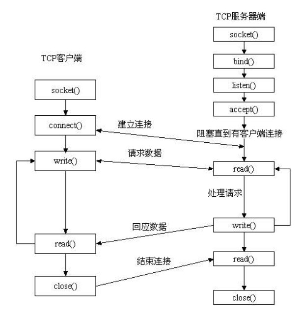

# socket通信原理

原理：服务器端先初始化Socket;然后与端口绑定，对端口进行监听，调用accept阻塞，等待客户端连接。客户端连接成功后，客户端发送数据请求，服务器端接收请求并处理请求，然后把回应数据发送给客户端，客户端读取数据，最后关闭连接。



> **TCP/UDP**协议通信过程

- 服务器端调用socket()通信过程：
  **socket()—>bind()—>listen()—>accept()—>recv()/recvfrom()—>send()/sendto();**
  调用socket()函数创建一个套接字。
  调用bind()函数把自己绑定在一个地址上。
  调用listen()函数监听连接。
  调用accept()函数接受所有引入的请求。
  调用recvfrom()函数获取引入的信息然后调用sendto()回答。
- 客户端调用socket()通信过程：
  **socket()—>connect()—>recv()/recvfrom()—>send()/sendto();**
  调用socket()函数创建一个套接字。
  调用connect()发出连接请求；
  调用recvfrom()函数获取引入的信息然后调用sendto()回答。

下面介绍几个基本的socket接口函数：

> **socket();**
> socket函数用于创建一个socket描述符(一个指向内部数据结构的指针，它指向描述符表入口)，把它作为参数进行一些读写操作。创建成功时，返回非负数的socket描述符；失败则返回-1。创建socket时，socket执行体将建立一个socket，即为一个socket数据结构分配存储空间。可以指定不同的参数创建不同的socket描述符。

函数原型：

```
int socket(int domain, int type, int protocol);1
```

参数说明：

1. 第一个参数**domain**指明使用的协议族。常用的协议族有，AF_INET，AF_INET6，AF_LOCAL（或称AF_UNIX，Unix域socket），AF_ROUTE等等。

- 协议族决定了socket的地址类型，在通信中必须采用对应的地址，如AF_INET决定了要用ipv4地址（32位的）与端口号（16位的）的组合、AF_UNIX, 表示这个socket是非网络形式的unix域socket, 可以用来进行非网络形式的进程间通信（本地进程间的通信）。

2. 第二个参数**type**：指定socket类型，常用的类型有三种。
   1).SOCK_STREAM：TCP类型。这个协议是按照顺序的、可靠的、数据完整的基于字节流的连接。
   2).SOCK_DGRAM ：[UDP](https://so.csdn.net/so/search?q=UDP&spm=1001.2101.3001.7020)类型。这个协议是无连接的、固定长度的传输调用。不保证数据接收的顺序，非可靠连接。
   3).SOCK_RAW ：原始类型，允许对底层协议如IP或ICMP进行直接访问。
   3.第三个参数**protocol**：公共协议，通常赋值0，由系统自动选择对应默认协议。常用的公共协议有，IPPROTO_TCP、IPPTOTO_UDP、IPPROTO_SCTP、IPPROTO_TIPC等。分别对应TCP传输协议、UDP传输协议、STCP传输协议、TIPC传输协议。

注意：type和protocol使用时要对应。

> **bind()；**
> bind();将创建的socket绑定到指定的IP地址和端口上，即分配一个具体的协议地址，如对应AF_INET、AF_INET6就是把一个ipv4或ipv6地址和端口号组合赋给socket。返回值为0成功，-1则出错。服务器端调用bind()，而客户端不需调用，会在connect()时由系统随机生成一个。

函数原型：

```
int bind(int sockfd, const struct sockaddr *myaddr, socklen_t addrlen);1
```

参数说明：

1. 第一个参数**sockfd**是socket函数返回的描述符，唯一标识一个socket。
2. 第二个参数**myaddr**一个指向要绑定本地IP和端口号的指针，使用网络字节序，包含有关的地址的信息：名称、端口和IP地址。这个地址结构根据地址创建socket时的地址协议族的不同而不同。
   可以用下面的赋值实现自动获得本机IP地址和随机获取一个没有被占用的端口号：

```
my_addr.sin_port = 0;  //系统随机选择一个未被使用的端口号 
my_addr.sin_addr.s_addr = INADDR_ANY; // 填入本机IP地址 12
```

3. 第三个参数**addrlen**对应地址长度，常被设置为sizeof(struct sockaddr)。
   注意：端口号的设置。1~1024都是保留下端口号，没有root 权利无法使用。可以使用1024~65535 以上的任何端口。bind()的常见错误是EADDRINUSE，即指定的端口号被使用了，端口在同一时刻只能被一个进程使用,IP地址可以被多个进程使用。

> **listen();**
> listen()用来监听socket，如果客户端这时调用connect()发出连接请求，服务器端就会接收到这个请求。成功返回0，错误返回-1。socket()函数创建的socket默认是一个主动类型的，函数listen()会将套接口转换为被动式[套接字](https://so.csdn.net/so/search?q=套接字&spm=1001.2101.3001.7020)，指示内核接受向此套接字的连接请求，调用此系统调用后tcp 状态机由close转换到listen。

函数原型：

```
int listen(int sockfd, int backlog);1
```

参数说明：

1. 第一个参数**sockfd**是一个套接字描述符，为要监听的socket描述字。
2. 第二个参数**backlog**指定了内核为此套接字排队的最大连接个数。即当系统还没有调用accept()函数的时候，如果有很多连接，那么本地能够等待的最大数目。包括“未完成连接队列–未完成3次握手”、“已完成连接队列–已完成3次握手，建立连接”。大多数系统缺省值为20。

> **accept();**
> accept()函数仅被TCP类型的服务器程序调用。从已完成连接队列返回下一个建立成功的连接，如果已完成连接队列为空，线程进入阻塞态睡眠状态。如果accpet()执行成功，返回由内核生成的一个新的socket描述符（已连接套接字），用它代表与客户端的TCP连接，错误时返回-1。一个服务器通常只有1个监听套接字，它在该服务器的生命周期内一直存在。服务器内核为每一个服务端接受的客户端连接维护1个已连接套接字，用它实现数据双向通信。当服务器完成了对某个客户的服务，相应的已连接socket描述字就被关闭。

函数原型：

```
int accept (int sockfd, struct sockaddr *addr, socklen_t *addrlen)1
```

参数说明：

1. 第一个参数**sockfd**为服务器的socket()函数返回的描述符，即监听套接字。

2. 第二个参数**addr** 为输出的一个sockaddr_in变量地址，该变量用来存放发起连接请求的客户端的协议地址。

3. 第三个参数**addrlen**即sizeof(struct sockaddr_in)，作为输入时指明缓冲器的长度，作为输出时指明addr的实际长度。

> **connect();**
> connect();客户端通过调用connect函数来建立与TCP服务器的连接。实际是发起3次握手过程，连接成功返回0，连接失败返回1。

函数原型：

```
int connect (int sockfd, struct sockaddr *serv_addr, int addrlen);1
```

参数说明：

1. 第一个参数**sockfd**本地客户端的socket描述符。
2. 第二个参数**serv_addr** 存储服务器IP地址和端口信息的结构。
3. 第三个参数**addrlen**地址缓冲区的长度，应该是sizeof(struct sockaddr)。
   注意：
   (1) 可以在UDP连接中使用connect()，作用是在UDP套接字中记住目的地址和目的端口。
   (2) UDP套接字使用connect后，如果数据报不是connect中指定的地址和端口，将被丢弃。没有调用connect的UDP套接字，将接收所有到达这个端口的UDP数据报，而不区分源端口和地址。

> **send();**
> send()函数为TCP类型的数据发送。实际是内核将用户数据拷贝至TCP套接口的发送缓冲区的过程。send先比较发送数据的长度len和套接字socket的发送缓冲的大小，若len大于发送缓冲区大小，则返回-1；否则，查看缓冲区剩余空间是否容纳得下要发送的len长度，若不够，则拷贝一部分，并返回拷贝长度，若缓冲区满，则等待发送，有剩余空间后拷贝至缓冲区；若在拷贝过程出现错误，则返回-1。如果send在等待协议发送数据时出现网络断开的情况，则会返回-1。关于错误的原因，查看errno的值。如果send函数copy数据成功，就返回copy的字节数。

注意：send函数把buf中的数据成功copy到发送缓冲区的剩余空间里后它就返回了，所以send成功返回并不代表对方已接收到数据，如果后续的协议传输过程中出现网络错误，下一个send便会返回-1发送错误。TCP给对方的数据必须在对方给予确认时，方可删除发送缓冲区的数据。否则，会一直缓存在缓冲区直至发送成功（TCP可靠数据传输）。

函数原型：

```
int send(int sockfd, const void *msg, int len, int flags)1
```

参数说明：

1. 第一个参数**sockfd** 发送端套接字描述符（非监听描述符）。

2. 第二个参数**msg** 待发送数据的缓冲区。

3. 第三个参数**len**待发送数据的字节长度。

4. 第四个参数**flags**调用操作方式，一般情况下置为0。

> **sendto();**
> 用于非可靠连接(UDP)的数据发送，因为UDP方式未建立连接socket，因此需要指定目的协议地址。因为UDP没有真正的发送缓冲区，因为是不可靠连接，不必保存应用进程的数据拷贝，应用进程中的数据在沿协议栈向下传递时，以某种形式拷贝到内核缓冲区，当数据链路层把数据传出后就把内核缓冲区中数据拷贝删除。因此它不需要一个发送缓冲区。写UDP套接口的sendto/write返回表示应用程序的数据或数据分片已经进入链路层的输出队列，如果输出队列没有足够的空间存放数据，将返回错误。

函数原型：

```
int sendto(int sockfd, const void *msg, int len, unsigned int flags, const struct sockaddr *dst_addr, int addrlen);1
```

参数说明：

1. 第一个参数**sockfd**发送端套接字描述符（非监听描述符）。

2. 第二个参数**msg**待发送数据的缓冲区。

3. 第三个参数**len** 待发送数据的字节长度。

4. 第四个参数**flags** 调用操作方式，一般情况下置为0。

5. 第五个参数**dst_addr** 数据发送的目的机的IP地址和端口信号。

6. 第六个参数**addrlen** 为sizeof （struct dast_addr），地址长度。

> **recvfrom();**
> recvfrom();用于非可靠连接(UDP)的数据接收,利用数据报方式进行数据传输。若无错误发生，recvfrom()返回读入的字节数。如果连接已中止，返回0。否则的话，返回SOCKET_ERROR错误，应用程序可通过WSAGetLastError()获取相应错误代码。

函数原型：

```
int recvfrom(int sockfd, void *buf, size_t len, int flags, struct sockaddr *src_addr, int*fromlen);1
```

参数说明：

1. 第一个参数**sockfd**接收端套接字描述符。

2. 第二个参数**buf**用于接收数据的应用缓冲区地址，存放接收到的数据。。

3. 第三个参数**len** 以字节计算的接收缓冲区长度；

4. 第四个参数**flags** 调用操作方式，通常为0；

5. 第五个参数**src_addr**数据来源端的缓冲区地址；

6. 第六个参数**fromlen** 指向src_addr缓冲区长度值。作为输入时，fromlen常置为sizeof(struct src_addr)；当输出时，fromlen包含实际存入buf中的数据字节数。

> **recv();**
> [recv](https://so.csdn.net/so/search?q=recv&spm=1001.2101.3001.7020)();TCP类型的数据接收。recv()先等待socket的发送缓冲中的数据被协议传送完毕，从接收缓冲区拷贝数据。成功时，返回拷贝的字节数，失败返回-1。阻塞模式下，recv将会阻塞到缓冲区里至少有一个字节才返回，没有数据时处于休眠状态。若非阻塞，则立即返回。

函数原型：

```
int recv(int sockfd, void *buf, int len, unsigned int flags);1
```

参数说明：

1. 第一个参数**sockefd**，接收端套接字描述符。
2. 第二个参数**buf**，接收缓冲区的基地址，该缓冲区用来存放接收到的数据。
3. 第三个参数**len**， 以字节计算的接收缓冲区长度。
4. 第四个参数**flags**，一般情况下置为0。

> **close();**
> 关闭相应的socket套接字，将不会再允许进行读操作和写操作。任何有关对套接字描述符进行读和写的操作都会接收到一个错误。

函数原型：

```
int close(int sockfd);1
```

参数说明：**sockfd**为本地的socket描述符。

> **shutdown();**
> shutdown允许你进行单向的关闭操作，或是全部禁止掉。

函数原型：

```
#include <sys/socket.h>
int shutdown（int sockfd, int how）;12
```

参数说明：

1. 第一个参数**sockfd**是一个你所想关闭的套接字描述符。
2. 第二个参数**how** 可以取下面的值:
   0 表示不允许以后数据的接收操作；
   1 表示不允许以后数据的发送操作；
   2 表示和close()一样，不允许以后的任何操作（包括接收，发送数据）

